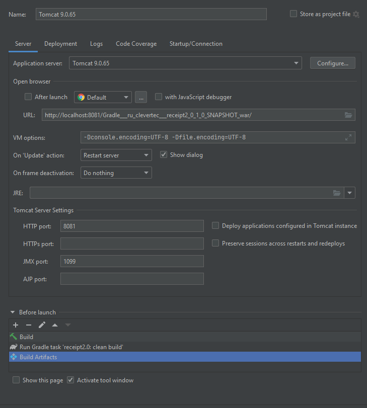

# README #

Приложение, реализующее функционал формирования чека в магазине.

### Запуск приложения ###

Приложение имеет 2 способа запуска:
* Как консольное приложение:  
  приложение запускается java ReceiptRunner <набор_параметров>, где набор параметров в формате itemId-quantity 
  (itemId - идентификатор товара, quantity - его количество).
  Например: java ReceiptRunner 3-1 2-5 5-1 card-15 должен сформировать и вывести в консоль чек содержащий в себе
  наименование товара с id=3 в количестве 1шт, то же самое с id=2 в количестве 5 штук, id=5 - одна штука и т. д. 
  Card-15 означает, что была предъявлена дисконтная карта с номером 15.
* Как локальное web-приложение:  
  приложение запускается на локальном сервере Tomcat.  
  Настройки локального сервера Tomcat:  
    
  Для работы с web-приложением реализованы следующие запросы:
  * Получить список продуктов  
    http://localhost:8081/Gradle___ru_clevertec___receipt2_0_1_0_SNAPSHOT_war/api/products?size=<?>&page=<?>  
    Где size - размер списка, page - номер страницы.
  * Получить продукт по id  
    http://localhost:8081/Gradle___ru_clevertec___receipt2_0_1_0_SNAPSHOT_war/api/product?id=<?>  
    Где id - идентификатор товара.
  * Добавить продукт   
    http://localhost:8081/Gradle___ru_clevertec___receipt2_0_1_0_SNAPSHOT_war/api/product/add?name=<?>&price=<?>  
    Где name - имя продукта, price - цена за единицу продукта.
  * Обновить продукт  
    http://localhost:8081/Gradle___ru_clevertec___receipt2_0_1_0_SNAPSHOT_war/api/product/update?id=<?>&name=<?>&price=<?>  
    Где id - идентификатор товара, name - новое имя продукта, price - новая цена за единицу продукта.
  * Удалить продукт  
    http://localhost:8081/Gradle___ru_clevertec___receipt2_0_1_0_SNAPSHOT_war/api/product/remove?id=<?>  
    Где id - идентификатор товара.
  * Получить список дисконтных карт  
    http://localhost:8081/Gradle___ru_clevertec___receipt2_0_1_0_SNAPSHOT_war/api/cards?size=<?>&page=<?>  
    Где size - размер списка, page - номер страницы.
  * Получить карту по id  
    http://localhost:8081/Gradle___ru_clevertec___receipt2_0_1_0_SNAPSHOT_war/api/card?id=<?>  
    Где id - идентификатор карты.
  * Добавить карту   
    http://localhost:8081/Gradle___ru_clevertec___receipt2_0_1_0_SNAPSHOT_war/api/card/add?discount=<?>  
    Где discount - скидка в %.
  * Обновить карту  
    http://localhost:8081/Gradle___ru_clevertec___receipt2_0_1_0_SNAPSHOT_war/api/card/update?id=<?>&discount=<?>  
    Где id - идентификатор карты, discount - новая скидка в %.
  * Удалить карту  
    http://localhost:8081/Gradle___ru_clevertec___receipt2_0_1_0_SNAPSHOT_war/api/card/remove?id=<?>  
    Где id - идентификатор карты.
  * Получить PDF-чек  
    http://localhost:8081/Gradle___ru_clevertec___receipt2_0_1_0_SNAPSHOT_war/api/getReceipt?source=<?>  
    Где source - строка с входными параметрами для генерации чека (Например: 3-1 2-5 5-1 card-15).  

  Примечание: Вместо <?> надо задать исходные параметры.

### Использованные библиотеки ###
Были использованы следующие библиотеки:
* lombok;
* wagu - представление данных (текста) в таблицах и блоках.
* jdbc;
* liquibase;
* itext7;
* javax.servlet;
* gson.

### Примечания ###
В исходных данных (база данных) доступны следующие диапазоны:
* id товара от 1 до 30;
* id дисконтной карты от 1 до 30.

